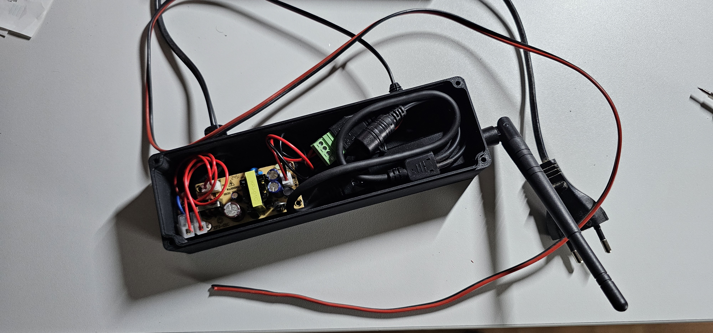
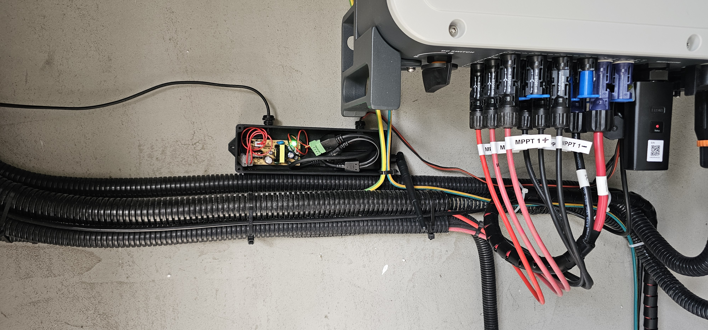
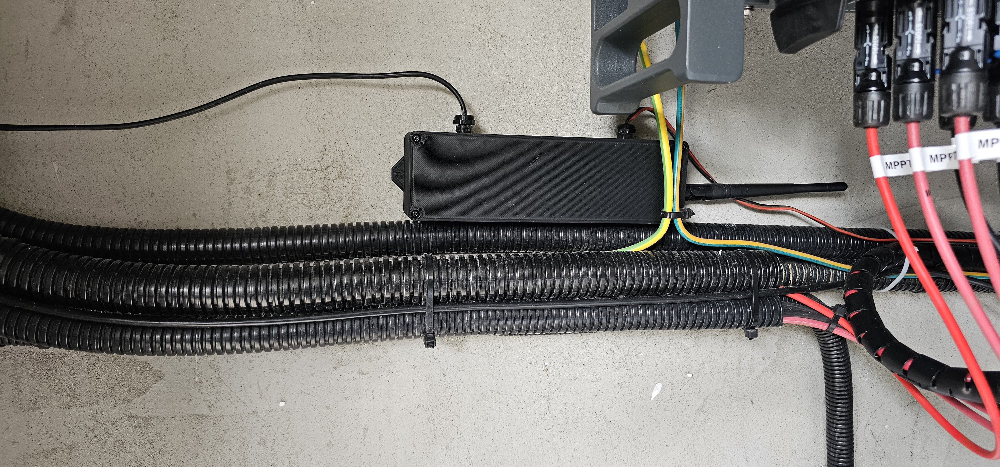

# FoxESS Modbus Connection

## Introduction

This guide demonstrates how to integrate a FoxESS H3 PRO inverter with home automation systems using the Modbus protocol. By establishing a direct connection to the inverter, you can obtain real-time readings for more precise energy management and automation.

This implementation is based on the [HACS FoxESS Modbus integration](https://github.com/nathanmarlor/foxess_modbus) project.

## Hardware Requirements

To set up the connection, you'll need the following components:

1. **Modbus/Serial to Ethernet/WiFi Adapter**
   - Model: Elfin EW11
   - Purpose: Enables network connectivity for newer FoxESS inverters
   - [Purchase Link](https://www.aliexpress.com/item/1005006418389013.html)

2. **Power Supply**
   - Type: 220V to 12V DC converter (minimum 1A output)
   - Purpose: Powers the Elfin EW11 adapter
   - [Purchase Link](http://aliexpress.com/item/4001068798705.html)

3. **Enclosure**
   - A 3D-printed enclosure to house the components
   - [Box Model](https://www.printables.com/model/72839-customizable-parametric-stable-and-waterproof-elec)
   - [Cable Glands](https://www.printables.com/model/114283-cable-gland-all-sizes)

> Note: While the enclosure design is waterproof-capable, the antenna hole modification affects this feature. This isn't critical for indoor installations.

## Installation Results

Here are the photos of the completed installation:

_Initial setup and testing on the workbench_

_Installation connected to the inverter_

_Completed installation with enclosure closed_
